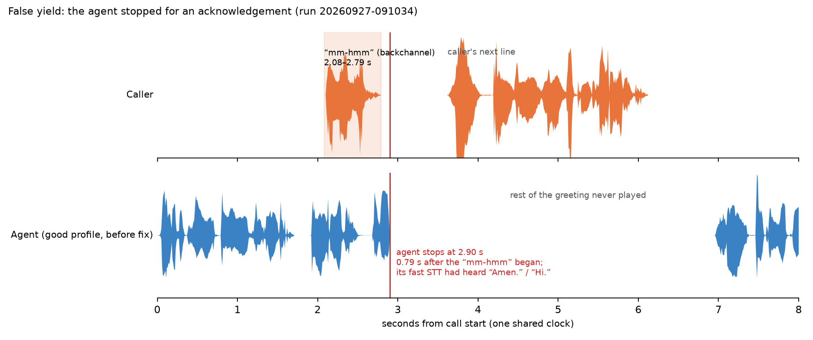

# Callback

Callback phones your voice agent with simulated callers, deliberately makes the call
messy, and measures what happened from the recorded audio.

**Status:** Early release. Not on PyPI yet. Feedback welcome.



*A real test call: the caller says "mm-hmm" (top) and the agent (bottom) stops talking
and never finishes its greeting. Callback flags this as a false yield. Listen:
[before](docs/assets/good-false-yield-amen-before-fix.mp3),
[after the agent was fixed](docs/assets/good-same-seed-after-fix.mp3).*

## Why

Voice agents fail in ways a text test never sees. They answer too slowly. They keep
talking when the caller interrupts, or stop dead for a harmless "mm-hmm". They read a
booking code back wrong. They confirm something they never saved. None of that shows
up in a transcript of what the agent *meant* to say; it shows up in the audio of the
call and in what actually happened afterwards.

## What it does today

- **Simulated callers.** A scripted caller says fixed lines. An AI caller (Gemini's free
  tier by default) plays a persona with a goal, known facts, patience and language, in
  its own words.
- **Calls that go wrong on purpose.** Callers that interrupt, say "mm-hmm" while the
  agent talks, go silent, change their mind, ask for a human, press keypad tones, or
  call from a noisy street over a bad line with dropped and delayed audio. Every
  disturbance is seeded, so the same call can be run again exactly.
- **Measurements from the recording.** Both sides are recorded on one clock. Callback
  measures how long the agent takes to answer, how fast it stops when interrupted,
  how much it talks over the caller, whether it stops for acknowledgements, and
  whether it checks in on a silent caller.
- **Checks on the outcome.** After the call, Callback asks your system for the real
  end state (for example, did the booking move to the right time?). It checks that
  the agent actually said required facts (a booking code, a party size, a time, a
  phone number), and that it never said anything a rule forbids.
- **Honest about doubt.** If Callback's own speech recognition is unsure whether the
  agent said a fact wrong or the line swallowed a sound, the check goes on a review
  list for a person instead of failing the agent.
- **Two example agents.** A restaurant booking agent and a copy with deliberate bugs,
  so you can see every check pass and fail without building anything.
- **A pass/fail exit code** for scripts and CI: 0 pass, 1 fail, 2 could not run.

It talks to agents over a WebSocket that carries raw 16 kHz audio, or joins them in a
LiveKit room ([docs/transports.md](docs/transports.md)).

## Quickstart (from source)

Tested on macOS with Apple Silicon. Needs Python 3.12,
[uv](https://docs.astral.sh/uv/) and espeak-ng (used by the local voice).

```bash
brew install uv espeak-ng
git clone https://github.com/imshivamb/callback.git
cd callback
uv sync --extra local
uv run callback doctor
```

`doctor` should show every **CORE** and **LOCAL MODELS** line green. Speech models
download on first use (a few hundred MB, into `~/.cache`). The AI caller needs a free
Gemini key in a `.env` file (`GEMINI_API_KEY=...`); the steps below don't.

The fastest way to see it work, with no keys and no setup:

```bash
uv run callback demo
```

It starts the bundled buggy agent, calls it twice with chaos (the caller interrupts it,
then says "mm-hmm" while it talks), fails with exit code 1 after about two and a half
minutes, and opens the report on the moment it talked over the caller. `--good` calls
the good agent instead, which passes.

To test your own agent, start a project in an empty folder:

```bash
uv run callback init     # callback.yaml and scenarios/example.yaml
```

Then point the `my-agent` target in `callback.yaml` at your agent's WebSocket.

Or try the bundled agents yourself. Start the two example agents, each in its own terminal:

```bash
uv run callback agent serve                        # the good agent, port 8765
uv run callback agent serve --buggy --port 8766    # the buggy copy, port 8766
```

You can also talk to either one yourself in Chrome at http://127.0.0.1:8765
(use headphones).

In a third terminal, run the chaos suite against each agent. Each call takes about
a minute of real time.

```bash
uv run callback run scenarios/chaos                            # good agent: PASS, exit 0
uv run callback run scenarios/chaos --agent restaurant-buggy   # buggy agent: FAIL, exit 1
```

Replay a call with the same seed, caller and disturbances:

```bash
uv run callback replay backchannel--t1
```

It re-runs the most recent call with that id and prints `identical` twice when the
caller's lines and every disturbance matched. Its exit code is the replayed call's
result.

Each run writes `.callback/runs/<run id>/report.html`: one file that opens offline
and shows the verdict, then every call as two waveforms (caller and agent) on one
time axis, with red pins where something went wrong, chaos markers, a latency bar
per answer, and the audio. It opens on the first failing call; click a pin (or press
`N`) to hear the moment. Next to it are `results.json`, `junit.xml`, and for every
call a stereo recording (`call.wav`, caller on the left, agent on the right) and an
event log. [docs/testing.md](docs/testing.md) walks through all of it.

## Example results

The chaos suite against both example agents, from the quickstart above
([good agent results](docs/assets/example-results/good-agent-chaos.json),
[buggy agent results](docs/assets/example-results/buggy-agent-chaos.json)):

| Scenario | What goes wrong | Limit | Good agent | Buggy agent |
|---|---|---|---|---|
| `barge-in` | The caller cuts in mid-sentence | stops within 0.6 s | 0.53 s | 1.16 s ([listen](docs/assets/buggy-barge-in-talks-over.mp3)) |
| `backchannel` | The caller says "mm-hmm" and "okay" while the agent talks | 0 stops | 0 | 6 ([listen](docs/assets/buggy-false-yield.mp3)) |
| `silent-caller` | The caller goes quiet for 12 s | checks in within 8 s | 5.25 s | never |
| `rough-line` | Street noise, dropped and delayed audio | completes | completes | completes |
| all four | Time to answer, 95th percentile | 1.5 s | 0.90–0.98 s | 2.21–2.35 s |

The audio clips are described in [docs/assets/README.md](docs/assets/README.md).

## How it decides pass or fail

- **Measured from the audio.** Timing comes from voice activity detection on the
  recording, not from the agent's logs. On synthetic calls with known timings it scores
  within ±50 ms ([test](tests/e2e/test_scoring_accuracy.py)).
- **Hard checks decide.** Only rule-based checks can fail a run: timings, the real end
  state, required facts, and pattern rules.
- **Real targets, even on slow CI.** The reply-delay target is 1.5 s. Our own test
  workflow runs on GitHub's shared machines, which are slower at speech synthesis, so it
  loosens that one limit to 2.0 s (`CALLBACK_CI_LATENCY_LIMIT_S`). Any run that does so
  says it in its results file and report; 2.0 s is not the target
  ([details](docs/testing.md#the-ci-latency-limit)).
- **The AI judge is advisory.** An optional LLM judge can rate conversation quality and
  plain-English rules. Its scores are recorded but never fail a run. In one saved call
  it rated the buggy agent 4–5 out of 5 while the agent read the booking code back
  wrong ([the call](tests/fixtures/disagreements/judge-vs-facts-wrong-code/README.md)).
- **Repeated calls, honest ranges.** A scenario runs several times; limits apply
  across its calls, with 95% confidence ranges. A saved baseline catches a regression
  even under the limits: in [this test](tests/e2e/test_baseline_gate.py)
  ([results](docs/assets/example-results/baseline-gate/)) a 0.4 s
  slower agent (p95 0.93 s → 1.31 s, limit 1.5 s) exits 1 against the baseline while
  the unchanged agent exits 0. Each run also writes `junit.xml`.
- **Reproducible.** Every call is seeded and can be replayed. AI caller lines are
  recorded on the first run and replayed afterwards without calling the model.
- **Local and free by default.** Speech recognition, voices and voice activity
  detection run on your machine. The only network use is the optional AI caller and
  judge (free tier) and the first model downloads.

## Coming next

- Calling agents over real phone numbers.
- `pip install`.

## Docs

- [docs/testing.md](docs/testing.md): running, reading results, chaos, replay, the
  test suite.
- [docs/transports.md](docs/transports.md): connecting to your agent over a WebSocket
  or a LiveKit room, and what LiveKit adds to the numbers.
- [docs/ci-example.md](docs/ci-example.md): running Callback in your own CI, with a
  baseline and a copy-paste GitHub Actions workflow.
- [docs/assets/README.md](docs/assets/README.md): what each recording and figure shows.

## License

Apache-2.0. See [LICENSE](LICENSE) and [NOTICE](NOTICE) (the bundled Silero VAD model
is MIT-licensed).
