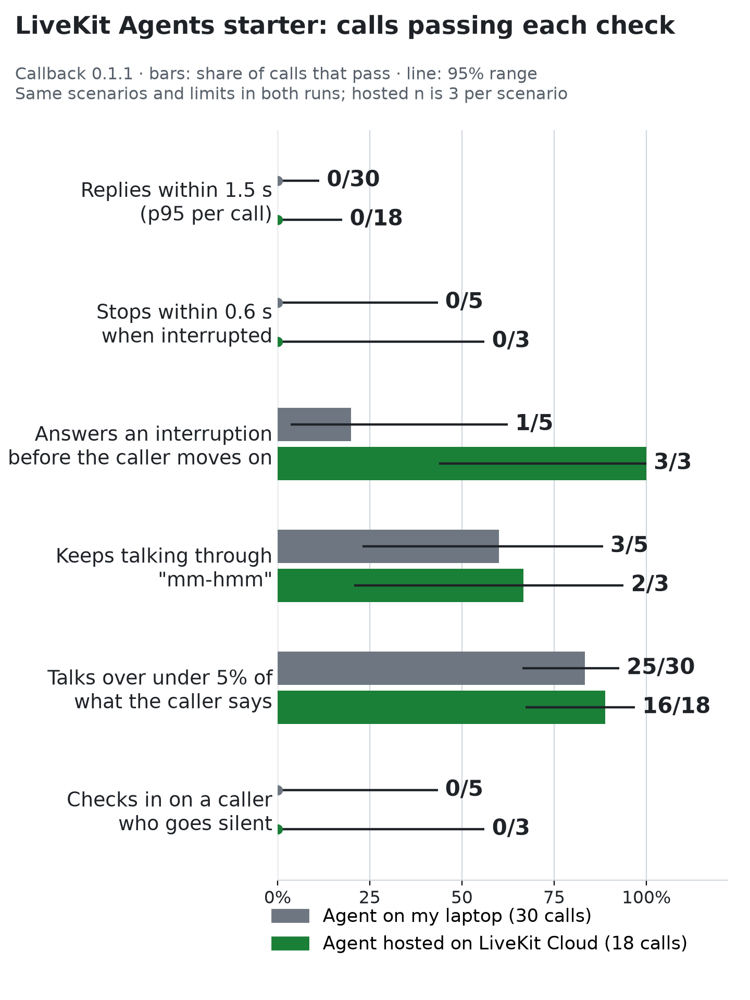

# Callback against the LiveKit Agents starter

I pointed Callback at the voice agent that LiveKit's own starter template builds, run
as its docs set it up, and measured what happened from the recorded audio. I ran it
twice: with the agent on my laptop (30 calls), and deployed to LiveKit Cloud (18
calls). This page is what I found, what Callback got wrong along the way, and what
this cannot tell you.

**The headline:** when the caller cut in mid-sentence, the agent kept talking for about
1.1 s at the caller's ear (1.00–1.17 s, limit 0.6 s) in all 8 interrupted calls, on my
laptop and hosted alike. The agent's own log shows it deciding to stop about 0.41–0.46 s
after the caller started speaking; the rest of the time is the audio path. Details are in
[finding 1](#what-i-found) and [where the time goes](#stop-when-interrupted-where-the-time-goes).



## What I found

These are about how the agent behaves. The limits are Callback's defaults, set before
I saw any result; they are not LiveKit's claims about the starter.

1. **It is slow to stop when interrupted, and that is not the setup.** Measured at the
   caller's ear, the agent kept talking for 1.00–1.17 s after the caller cut in (limit
   0.6 s), in all 8 interrupted calls: 1.00–1.17 s on my laptop, 1.03–1.05 s hosted.
   Where the time goes: in the 3 laptop calls where the agent's log recorded its
   decision, it decided to stop 0.41–0.46 s after the caller started speaking. The other
   0.55–0.6 s is the audio path in both directions, and not Callback's measurement,
   which agrees with the raw audio to within 0.01 s
   ([details](#stop-when-interrupted-where-the-time-goes)).
2. **Median replies took 2.5–3.7 s, and 0 of 48 calls met the 1.5 s limit.**
   Median reply delay was 3.67 s on my laptop and 2.47 s hosted. Moving the agent to
   LiveKit Cloud cut about 1.2 s; the rest is the agent's own pipeline
   ([details](#reply-delay-and-how-much-of-it-was-my-setup)). One sentence
   of my script made the agent's turn detector wait the full 2.5 s in 10 of 10 test
   calls, with or without a pause in my caller's voice. That is one sentence, one voice
   and one agent, and I did not test other wordings
   ([details](#end-of-turn-waits-one-sentence-the-agent-keeps-waiting-on)).
3. **It mostly ignores "mm-hmm", with exceptions.** It kept talking through 21 of 24
   acknowledgements (88%). Three made it stop, 0.79–0.94 s after the caller spoke: 2
   of 15 on my laptop, 1 of 9 hosted. That is 3 of 8 calls with at least one false
   stop. On the laptop, the agent's own log flagged 5 of the 15 acknowledgements as
   interruptions, and 2 of those became stops.
4. **It does not check in on a caller who goes silent.** After 12.8 s of silence, 0 of
   8 calls got a prompt (limit 8 s). See
   [the observation](#silent-caller-an-observation-about-a-general-assistant).
5. **An observation I did not test: whether an interruption gets answered may depend on
   speed.** On my laptop, 4 of 5 interrupted calls ended with the interruption
   unanswered under the scoring rule I fixed in advance (1 more counted as "folded", see
   [below](#the-folded-rule)). Hosted, 0 of 3 did. The agent's replies to the
   interruption arrived 2.1–2.2 s after the caller finished when hosted, inside the
   2.5 s the scripted caller waits, and later on my laptop. The speed difference is the
   likely cause. I did not test it.

### What it did well

- **Every call completed.** All 54 calls (48 counted and 6 warm-ups) connected, ran to a
  normal caller hang-up and ended with no error and no timeout, including after the
  hosted agent had scaled down.
- **The cut-in was taken on board.** In the 5 laptop interruption calls, where I
  transcribed what the agent said, every one used "six people" in its next full
  reply. I did not transcribe the hosted calls.
- **Street noise cost it nothing I could measure.** With street noise at 15 dB, 3%
  packet loss and 60 ms jitter, reply delay in `rough-line` was in line with the other
  scenarios (median 3.38 s laptop, 2.45 s hosted). I checked timing only, not what it
  said.
- **It rarely mistook an acknowledgement for an interruption** (21 of 24, above).

## What was tested

| | |
|---|---|
| Agent | [`livekit-examples/agent-starter-python`](https://github.com/livekit-examples/agent-starter-python), commit `76ddabb` (2026-10-02), unmodified: same prompt and settings |
| Framework | `livekit-agents` 1.8.4, `livekit-plugins-ai-coustics` 0.3.2, Python 3.14 (hosted container: `python:3.14`) |
| Models, all through LiveKit Inference | speech-to-text `assemblyai/universal-3-6-pro`; LLM `google/gemma-4-31b-it`; text-to-speech `fishaudio/s2.1-pro` with expressive mode on |
| Also on, as shipped | LiveKit's turn detector, adaptive interruption handling, ai-coustics noise cancellation on the caller's audio |
| Region | LiveKit Cloud project in India South (`ap-south`) |
| Callback | 0.1.1 plus uncommitted source changes (see [Callback bugs](#callback-bugs)); the same source for both runs |
| Caller | Scripted, English, voiced by Callback's local speech model; scoring uses Callback's local speech recognition and voice-activity detection |

I made one change that is not the starter's own, and I list it so nobody has to guess: the
starter's Dockerfile needs a `uv.lock`, which the repository does not contain. I deployed
with the lockfile my local install produced, so both runs use the same dependency versions
(confirmed from the hosted agent's log). LiveKit Cloud supplies the hosted agent's
credentials itself; I set no secrets on it until the pause test below, which added one
log-level variable for that test only.

## How

Six scenarios, each a scripted caller planning a vegetarian dinner and speaking first
([scenario files](results/livekit-starter-2026-10-03/scenarios-local/)):

| Scenario | What happens |
|---|---|
| `barge-in` | The caller cuts in 0.3 s into the agent's second reply |
| `backchannel` | The caller says "mm-hmm" or "okay" during each agent reply |
| `rough-line` | Street noise at 15 dB, then 3% packet loss, then 60 ms jitter |
| `silent-caller` | The caller says nothing for 12 s instead of answering the first question |
| `change-mind` | The caller changes the number of guests after the agent has started planning |
| `repeat-request` | The caller says they did not catch the answer and asks for it again |

- **Laptop run:** 30 calls, 5 per scenario, 04:27–04:58 UTC on 2026-10-03, 30.5 minutes.
  The agent ran on the same MacBook as Callback.
- **Hosted run:** 18 calls, 3 per scenario, 05:20–05:40 UTC the same day, 19.5 minutes.
  The agent (`CA_iH9pEBuukPvC`) ran on LiveKit Cloud. The agent's log shows all 24 calls,
  18 counted and 6 warm-ups, handled by worker `CAW_Dyw9W36VxQao` in `ap-south`
  ([jobs](results/livekit-starter-2026-10-03/hosted-agent-jobs.json)); no agent was
  running on my laptop.
- **Warm-ups:** the free plan scales the hosted agent to zero between sessions and
  adds a 10–20 s cold start. Before each scenario I made one two-line warm-up call. The
  six warm-ups are recorded separately
  ([`warmups-hosted.json`](results/livekit-starter-2026-10-03/warmups-hosted.json)) and
  are in no statistic. No counted call timed out.
- **Pause test:** after both runs, 10 more hosted calls and two warm-ups, described in
  [End-of-turn waits](#end-of-turn-waits-one-sentence-the-agent-keeps-waiting-on).
- **Same scoring:** the scenarios and limits are identical in both runs, except 5 trials
  against 3. I did not change anything in Callback between the runs.
- **Limits used (Callback's defaults):** reply delay p95 ≤ 1.5 s, stop within 0.6 s,
  talk-over ≤ 5% of the caller's speech, no stop for an acknowledgement, a check-in within
  8 s of silence, no unanswered turn.

## Where the limits come from

I chose them, and they are not an industry standard; I don't know of one. Callback's
defaults are a reply delay of 1.5 s (the slowest typical reply in a call), a stop within
0.6 s of being interrupted, talk-over under 5% of the caller's speech, no stop for an
acknowledgement, and a check-in within 8 s of silence. I set the reply limit from the idea
that a pause of 1.5 to 2 s after the caller stops talking feels broken, and the rest to go
with it.

For outside context only, I looked for reference points:

- **Human conversation.** The median gap between speakers is about 200 ms across ten
  languages, and a two-second reply is heard as an awkward silence, according to
  [Picovoice's guide to voice latency](https://picovoice.ai/guide/voice-agents/voice-ux-latency-turn-taking/)
  (it cites Stivers et al., 2009).
- **A third party's measurements of LiveKit's default setup.**
  [Cekura](https://www.cekura.ai/blogs/p99-latency-voice-ai-agents) reports a median reply
  of 2.46 s and 3.87 s at the 95th percentile, measured from the end of the caller's
  speech to the start of the agent's, as Callback does. My hosted run, 2.47 s and 3.69 s,
  sits in the same range. This is one vendor's benchmark, and Cekura is a company in the
  same space as Callback, so it is not a neutral source. It fixes the model, prompt and voice,
  which my run did not, and I could not confirm its publication date. I use it only to say
  my numbers are in a plausible range, not to compare platforms, and I make no comparison
  here.

None of this makes 1.5 s a standard. It is a bar I picked, and going above it means "slower
than my target", not "broken".

## Results

Calls within each limit, with 95% ranges. A count of 0 out of 3 is consistent with a true
rate anywhere up to 56%, so read the hosted column as direction, not as a rate.

| Check | Laptop | Hosted |
|---|---|---|
| Reply delay p95 ≤ 1.5 s (per call) | 0/30 (0–11%) | 0/18 (0–18%) |
| Stops within 0.6 s when interrupted | 0/5 (0–43%) | 0/3 (0–56%) |
| Interruption answered before the caller moves on (the laptop's 1 is the folded call) | 1/5 (4–62%) | 3/3 (44–100%) |
| Keeps talking through "mm-hmm" (calls with no false stop) | 3/5 (23–88%) | 2/3 (21–94%) |
| Talk-over ≤ 5% of the caller's speech | 25/30 (66–93%) | 16/18 (67–97%) |
| Checks in on a silent caller within 8 s | 0/5 (0–43%) | 0/3 (0–56%) |

I am not reporting an overall pass rate as a headline. It would be 0 of 48, because every
call went over the reply-delay limit, and that number hides everything in the table above.

### Stop when interrupted: where the time goes

The caller starts speaking at time 0. The agent keeps talking until it has decided to
stop, and some audio it already sent is still playing out. Callback's number
(1.00–1.17 s) is when the audio stops *at the caller's ear*. I asked whether the gap
between that and the agent's own detection (about 0.36 s) is audio already sent but not
yet played, or how Callback decides the agent has stopped.

- **Callback's stop edge is not the cause.** For all 8 interrupted calls I compared
  Callback's stop time with the last 10 ms of audible sound in the agent's channel: they
  agree to within 0.01 s.
- **The agent's decision explains about 0.4 s.** In the laptop log, "interruption
  detected" is recorded for 3 of the 5 interruptions. Putting the agent's clock on the
  recording's clock (using the first caller line as the reference), it fired 0.41–0.46 s
  after the caller started speaking (the log's own delay is 0.34–0.36 s).
- **The rest, 0.55–0.6 s, comes after that.** That time includes the caller's voice
  reaching the agent and, after the decision, audio already sent, in flight or buffered
  reaching the caller. The evidence supports the audio path and not Callback's measurement.
  It does not say how the 0.55–0.6 s splits between the agent's output queue, the network
  and the playout buffers; I can't separate those with this data.
- **Without a logged detection it was slower.** In the 2 laptop calls where the log has
  no detection, the agent still stopped, but after 1.15 s and 1.17 s, against 1.00–1.04 s
  in the 3 with one. I don't know what stopped it there.

The laptop log has 10 "interruption detected" lines, with delays of 0.31–0.81 s (median
0.36 s). Only 3 of them are interruptions of the kind measured here. Matched to the
recording, 5 were on acknowledgements ("mm-hmm", "okay"), 1 on the change of mind and 1 on
an ordinary line, so that median is not the stop-when-interrupted figure.

### Reply delay, and how much of it was my setup

Caller finishes speaking to the agent's first audio, every timed turn. Ranges are 95%
bootstrap ranges of the median (fixed seed).

| | Laptop (30 calls) | Hosted (18 calls) |
|---|---|---|
| Timed turns | 113 | 75 |
| Median | **3.67 s** (3.47–3.81) | **2.47 s** (2.39–2.76) |
| 95th percentile | 4.09 s | 3.69 s |
| First turn of a call, median | 2.82 s | 2.23 s |

| Scenario | Laptop median / p95 | Hosted median / p95 |
|---|---|---|
| `backchannel` | 3.47 / 4.02 s | 2.56 / 3.70 s |
| `barge-in` | 3.77 / 4.00 s | 2.35 / 3.62 s |
| `change-mind` | 3.88 / 5.73 s | 3.26 / 3.74 s |
| `repeat-request` | 3.83 / 4.08 s | 2.64 / 3.68 s |
| `rough-line` | 3.38 / 4.08 s | 2.45 / 3.64 s |
| `silent-caller` | 3.44 / 4.09 s | 2.41 / 3.69 s |

Moving the agent to LiveKit Cloud cut the median by about 1.2 s, with the two ranges not
overlapping. That much was my setup. On my laptop the agent and Callback's speech models
shared one machine, the noise-cancellation plugin repeatedly blocked the agent's event
loop for 101–405 ms (152 warnings in the agent's log during the run), and the agent
logged "VAD inference is slower than realtime" once. The agent's own pipeline got faster
too, by about 0.6 s on average per LiveKit (below), so most of the setup cost was the
agent running slowly, not the network.

The remaining 2.5 s is not the setup. Callback's own speech models still ran on my
laptop in the hosted run, and every call still crossed my internet connection to India
South; only the agent's compute moved. Even so, the hosted median is 1.6 times the limit,
and the hosted p95 is 3.69 s.

`change-mind` was slower than the others in both runs (3.88 s and 3.26 s medians). I did
not find out why.

### End-of-turn waits: one sentence the agent keeps waiting on

LiveKit's Observability for the hosted run shows the agent's end-of-turn stage (how long
it waits to be sure the caller has finished) with a long tail: median 408 ms, average
600 ms, p95 2,019 ms, p99 2,059 ms over 87 turns. I checked which of my caller's lines
those waits belong to, using the laptop agent's log (time from the end of the caller's
speech to the agent committing the turn):

| Caller line | Turns | Median wait | Waits over 1 s |
|---|---|---|---|
| "Hi, can you help me plan a simple dinner for four people tonight?" | 30 | 0.63 s | 0 |
| "I would like something vegetarian that takes under thirty minutes." | 30 | **2.50 s** | **29** |
| "Okay, and what do I need to buy from the shop?" | 20 | 0.61 s | 0 |
| "That sounds good. Thanks, that's all. Bye." (as one or two turns) | 30+ | 0.45–0.61 s | 0 |
| The interruption lines ("make that for six people", the change of mind) | 10 | 1.56 s | 5 |

The tail is one sentence. For that line the agent's end-of-turn model gave a probability
of 0.09 and 0.12 in the laptop turns I read in the log (its threshold is 0.56), and the
agent then waited the full 2.5 s. It is also the slowest line for reply delay in both runs
(median 4.02 s laptop, 3.62 s hosted, against 2.2–3.4 s for the lines without a pause).

Callback's voice leaves a pause of about 0.35 s inside that sentence (after "vegetarian"),
so there were two candidate causes: the agent's turn detector, or my caller's pause. I
tested it.

**The pause test.** On the hosted agent I ran the sentence two ways, 5 calls each,
alternating A and B so time of day could not favour either, after two warm-up calls that
are excluded. A is the sentence as recorded, with the pause. B has the same words and
voice with the pause removed (I wrote "vegetarian-that"; speech recognition transcribes it
identically and the 0.35 s gap is gone). I fixed the reading before running
([plan](results/livekit-starter-2026-10-03/pause-test/plan.md)): if B's median wait fell to
0.8 s or less while A stayed at 2.0 s or more, the pause is the cause; if B's stayed at
2.0 s or more, it is the agent's turn detector; anything else is inconclusive. To log the
end-of-turn probability, I set `LIVEKIT_LOG_LEVEL=DEBUG` on the hosted agent for this test
(both variants ran with it) and set it back to `INFO` afterwards.

| | A: with the pause (5 calls) | B: pause removed (5 calls) |
|---|---|---|
| Wait before the agent committed the turn | 2.5 s in 5 of 5 | **2.5 s in 5 of 5** |
| Logged end-of-turn probability (threshold 0.56) | 0.04–0.12 (median 0.06) | 0.21–0.32 (median 0.29) |
| Pieces voice-activity detection saw in the line | 2 in 5 of 5 | 1 in 5 of 5 |
| Agent's own transcript | "vegetarian, that" in 5 of 5 | "vegetarian that" in 5 of 5 |
| Reply delay to this line minus to the first line, median | 1.24 s (5 calls) | 1.29 s (4 calls) |

**Result: it is the agent's turn detector.** Under the rule I set, B's median wait is 2.5 s,
so the long wait does not come from Callback's pause. Removing the pause raised the
detector's probability from about 0.06 to about 0.29, so the pause does make it less sure,
but at 0.29 it is still far below the 0.56 threshold and the agent waited the full 2.5 s
every time. This is one sentence, one voice and one agent, 10 calls in all, and I did not
test other wordings; it may be about how this request ends, since a request like that
often continues. One B call has no reply-delay figure (the matching reply was not found),
which is why that column has 4.

Callback's pauses still matter for two other lines: at the goodbye line (after "That sounds
good.") and the repeat request, the voice-activity detector split the line in two in every
call (48 of 48 and 8 of 8), and the agent committed the first half as its own turn at the
pause (for example "That sounds good." alone, end-of-turn probability 0.73) and then heard
the rest as a second turn. That is a caveat about Callback's voice, not a finding about the
agent.

How much the vegetarian sentence matters: leaving it out, the median reply delay is 3.37 s
on my laptop and 2.39 s hosted; leaving out every line with a pause, 3.04 s and 2.29 s. The
1.5 s limit is still missed by a wide margin, so this sentence inflates the median by about
0.1–0.5 s without explaining the delay.

### Agent-side cross-check

Callback measures from the caller's side of the line. LiveKit's Observability dashboard
measures inside the agent. Screenshots:
[laptop window](docs/livekit-observability-local.png) (past 7 days: 37 sessions, the 30
counted calls and 7 smoke calls) and the hosted window
([overview](docs/livekit-observability-hosted-1.png),
[tails by stage](docs/livekit-observability-hosted-2.png),
[models](docs/livekit-observability-hosted-3.png): 24 sessions, which include the 6
warm-ups).

| Hosted, per LiveKit (tails by stage) | Median | p95 |
|---|---|---|
| End to end (58 turns) | 1,755 ms | 3,072 ms |
| Speech-to-text delay | 498 ms | 561 ms |
| End of turn (87 turns) | 408 ms | 2,019 ms |
| LLM time to first token (130 turns) | 441 ms | 983 ms |
| Text-to-speech time to first byte (87 turns) | 518 ms | 758 ms |

Comparing like with like, caller side (Callback) against agent side (LiveKit):

| | Callback (caller side) | LiveKit (agent side) | Gap |
|---|---|---|---|
| Hosted, median | 2.47 s | 1.755 s | 0.72 s |
| Hosted, mean (counted turns and warm-ups) | 2.73 s | 2.178 s | 0.55 s |
| Hosted, p95 | 3.68 s | 3.072 s | 0.61 s |
| Laptop, mean | 3.54 s | 2.771 s | 0.77 s |

I did not capture the laptop window's median or p95. The gap is 0.55–0.77 s in each
comparison, and I read it as what the audio path and Callback's side add: transport,
buffering and playout. It is about the same on the laptop and hosted. Between the two
runs, the agent's average fell from 2.77 s to 2.18 s and Callback's mean from 3.54 s to
2.73 s, so about three quarters of the improvement was the agent running faster, and about
a quarter the path.

Three things in the dashboards I can't reconcile: the end-to-end figures cover 58 turns
while my counted and warm-up turns total 87; the pipeline bar shows an average
speech-to-text delay of 249 ms and end of turn of 450 ms, against 499 ms and 600 ms in the
tails view; and the 2.0 s end-of-turn tail on the hosted agent against the 2.5 s waits in
the laptop log.

## Three moments to hear

Each clip is 11–13 s: an MP4 with a caption and a moving marker, plus the original audio
as a WAV (caller left channel, agent right). Times are seconds into the call. I checked
each clip's timing against the recorded waveforms.

**1. 4 s of silence before it answers.** In `repeat-request` call 1 on my laptop
([clip](results/livekit-starter-2026-10-03/clips/01-reply-delay.mp4),
[audio](results/livekit-starter-2026-10-03/clips/01-reply-delay.wav)), the caller finishes
a sentence at 15.4 s and the agent first speaks at 19.4 s: 3.97 s against a 1.5 s limit. The
other turns in that call took 2.72, 3.78 and 3.83 s.

**2. It talks on after being interrupted, then answers late.** In `barge-in` call 2 on my
laptop ([clip](results/livekit-starter-2026-10-03/clips/02-slow-to-stop-and-late-answer.mp4),
[audio](results/livekit-starter-2026-10-03/clips/02-slow-to-stop-and-late-answer.wav)), the
caller cuts in at 20.9 s. The agent stops about 1.15 s later, goes quiet for about 3.5 s, then says
"No problem" at 25.8 s, over the caller's next sentence. The agent's next full answer
arrives at 31.7 s and includes "For six people".

**3. It stops for an "mm-hmm".** In `backchannel` call 2 on my laptop
([clip](results/livekit-starter-2026-10-03/clips/03-stops-for-mm-hmm.mp4),
[audio](results/livekit-starter-2026-10-03/clips/03-stops-for-mm-hmm.wav)), the caller says
"mm-hmm" at 36.8 s as an acknowledgement. The agent stops 0.94 s later and says nothing
more until its last word at 44.7 s. One hosted call did the same, 0.79 s after "mm-hmm".

The full reports have every call with both waveforms and a mark where each limit was passed:
[laptop run](https://imshivamb.github.io/callback/livekit-starter/local.html) (without
audio) and [hosted run](https://imshivamb.github.io/callback/livekit-starter/hosted.html)
(with audio). Each is a single file that opens offline.

## The folded rule

Before the full run I fixed one scoring rule, and I did not change it afterwards. After a
caller interrupts and the agent does not answer on its own, Callback now counts the turn
as handled but flags it as *folded* if the agent's next reply repeats a content word the
interruption introduced (digits and number words count as the same word). Otherwise it is
an unanswered turn, which counts as over its limit.

Under that rule, 4 of 5 laptop interruption calls were unanswered and 1 was folded. The
rule has a weakness, and the second reading below shows its effect:

- In the 4 calls scored unanswered, the agent did take the interruption on board, but late:
  a short, cut-off "No problem…" about 3.5 s after the caller finished, over the caller's
  next line, and "six people" in its next full reply.
- The rule looks only at the first agent turn after the caller resumes, which in those
  calls was the fragment. Reading the next *full* reply instead, all 5 laptop calls would
  count as folded.

The headline stays at the pre-registered result. The second reading is a sensitivity note,
not a result I selected after the fact. After both runs I changed the rule to read the
agent's next full reply, and re-scored the laptop run from the recordings with that code:
5 of 5 interrupted calls fold, as the second reading says
([result](results/livekit-starter-2026-10-03/rescore-folded-fix.json)). The published
results and reports were scored before that change and are unchanged.

## Silent caller: an observation about a general assistant

The starter is a general-purpose assistant. Its prompt says to answer, keep replies short
and ask one question at a time; it says nothing about prompting a caller who stops
talking. So in all 8 `silent-caller` calls it simply waited, and when the caller resumed
after 12.8 s it carried on normally. Callback's check expects a check-in within 8 s, which
suits something like a booking line more than an open-ended assistant. I report it as
what this agent does, not as a defect in the starter.

## Callback bugs

I found these in Callback while running this. They are Callback's, not the agent's.

1. **The speech view put the caller's words in the agent's lines.** For a call Callback
   had transcribed, each agent stretch carried every overlapping turn's text, including the
   caller's, and repeated a whole turn on each piece. It affected the report's speech view
   and the `speech` field, not any metric. I fixed it after both runs: agent stretches now
   carry only the agent's own words inside them. I re-scored all 54 calls from the
   recordings with the fixed code. Every metric, every finding and every transcript came out
   identical to the stored results (54 of 54); only the speech view changed, in 5 laptop
   `barge-in` calls ([the diff](results/livekit-starter-2026-10-03/rescore-diff.json)). The
   caller's lines can still show the same text on two pieces when voice-activity detection
   splits one sentence in two; I did not change that.
2. **The folded rule matched the wrong turn when the agent answers late.** See the section
   above. I wrote that code during this work. The published numbers use it as it was; I
   fixed it after both runs (it now reads the first reply that starts after the caller's
   following line has ended) and added tests.
3. **`results.json` cannot say which Callback source or which agent version produced a run.**
   `git_sha` is the commit of the project folder, and it is `null` when that folder is not a
   git repository (mine was not), which is correct but not useful here. `callback_version`
   says 0.1.1 even with uncommitted source changes. I recorded the starter's commit and a
   hash of Callback's source by hand. This is a gap in what a run records, not a wrong value.
4. **LiveKit agents with an `agent_name` were never dispatched.** Callback created the room
   and waited 20 s for an agent that was never sent. I added an optional `agent_name`
   to the LiveKit target, which asks for that agent in each room Callback creates
   (documented in [docs/transports.md](docs/transports.md)). This was the first run of the
   transport against a real LiveKit Agents worker.

The source changes behind these runs are the `agent_name` dispatch and the folded rule, in
place for both runs with the same source hash. After both runs I fixed the speech view and
the folded rule's turn matching; the speech-view fix changes no metric (the diff above
shows that), while the folded-rule fix does change the laptop `barge-in` counts, from 4
unanswered to 5 folded. That is why I report it separately and did not replace the
published numbers.

## Reproduce

Needs Python 3.12 for Callback, `uv`, the LiveKit CLI (`lk`), and a LiveKit Cloud project.
Until these Callback changes are released, run from this repository's source:

```bash
git clone https://github.com/imshivamb/callback.git && cd callback
uv sync --extra local --extra livekit

# The agent, unmodified
git clone https://github.com/livekit-examples/agent-starter-python
cd agent-starter-python && git checkout 76ddabb
cp .env.example .env.local            # LIVEKIT_URL, LIVEKIT_API_KEY, LIVEKIT_API_SECRET
uv sync && uv run --module livekit.agents download-files

# Laptop run: start the agent here
uv run src/agent.py dev

# Hosted run instead: stop the local agent, then
lk project add my-project --url "$LIVEKIT_URL" --api-key "$LIVEKIT_API_KEY" --api-secret "$LIVEKIT_API_SECRET"
lk agent create --region ap-south .   # the Dockerfile needs the uv.lock from `uv sync`
```

Then, from a folder with `callback.yaml` and the scenarios from
[`results/livekit-starter-2026-10-03/`](results/livekit-starter-2026-10-03/) (put your
project URL in `callback.yaml`, and export `LIVEKIT_API_KEY` and `LIVEKIT_API_SECRET`):

```bash
callback run scenarios-local   # laptop run: 30 calls, about 30 minutes
callback run scenarios         # hosted run, with warm-ups: 24 calls, about 20 minutes
```

Every number on this page comes from the `results-*.json` files in that folder; the
unsplit originals are in `raw/`.

## Limits

- **The pause test is narrow.** One sentence, one synthetic voice, one agent, 5 calls per
  variant, hosted only. It shows that removing my caller's pause did not remove the wait for
  that sentence. It does not show why the detector waits, which other wordings it waits on,
  or that it would do the same with a human voice.
- **The pause test ran with debug logging on.** The hosted agent had `LIVEKIT_LOG_LEVEL=DEBUG`
  for the test (both variants), to log the end-of-turn probability. I set it back to `INFO`
  afterwards, so the secret still exists on the agent with that value. Debug logging could
  add a little latency.
- **One stack.** One agent, one set of models, one region, scripted English callers only.
  This says nothing about other LiveKit agents or about Pipecat.
- **Small and a first run.** 48 counted calls, and 3 per scenario hosted. Ranges are wide,
  and a different afternoon would give different numbers.
- **Two setups, not a controlled experiment.** The runs started about 53 minutes apart and differ
  in more than where the agent ran (for one, 5 trials against 3). The 1.2 s difference is
  an estimate of the setup's cost, not a measurement of one cause.
- **Callback's side of the line.** Callback's speech models and my internet connection were
  part of both runs.
- **Agent-side data is partial.** For the laptop window I have LiveKit's average reply
  but not its median or tails; the hosted window includes the 6 warm-ups; some dashboard
  figures do not reconcile (see the cross-check).
- **I could read the agent's own log for the laptop run and the pause test only.** The
  stop-when-interrupted breakdown rests on 3 laptop calls.
- **Limits are my choice, not a standard.** Going over one means "slower than the bar I
  picked", not "broken" ([where they come from](#where-the-limits-come-from)). Other limits
  would give other counts.
- **The folded rule is a word-overlap heuristic** on speech-recognition output. It does not
  judge whether the agent really handled an interruption.
- **Timing only for some claims.** I checked what the agent said only where noted.
